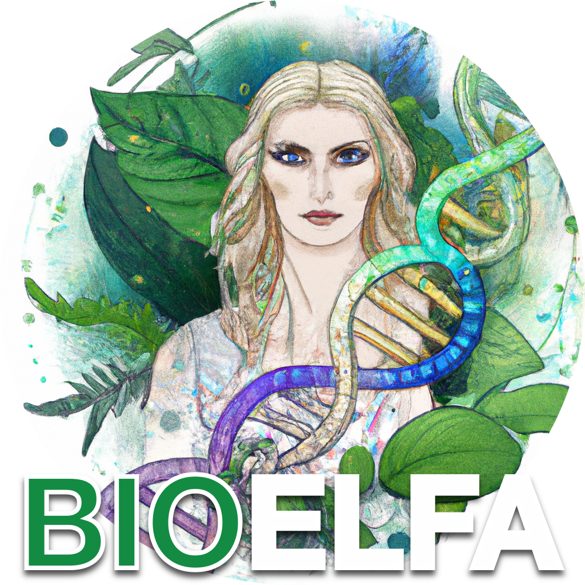

    
  

    
    
    

  

#

# 👉  👈

## 🙏 Contributing

This package is open-source and everyone is welcome to contribute and create PRs.

- Read the [CONTRIBUTING](CONTRIBUTING.md) document.
- Read the package [README](src/bioelfa/README.md) for more details.

## 🛡 License

This project is licensed under the terms of the `MIT` license. See [LICENSE](https://github.com/andraghetti/bioelfa/blob/master/LICENSE) for more details.
